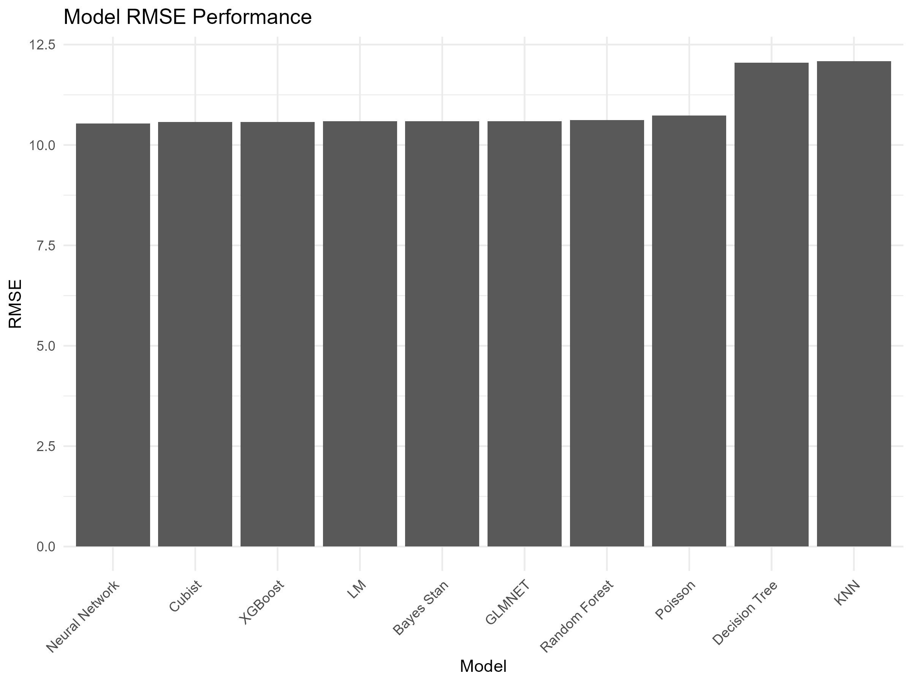
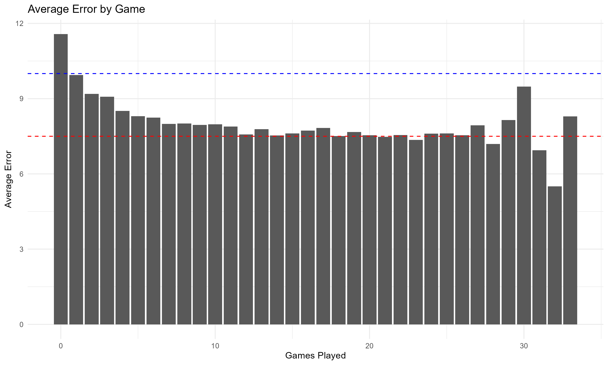
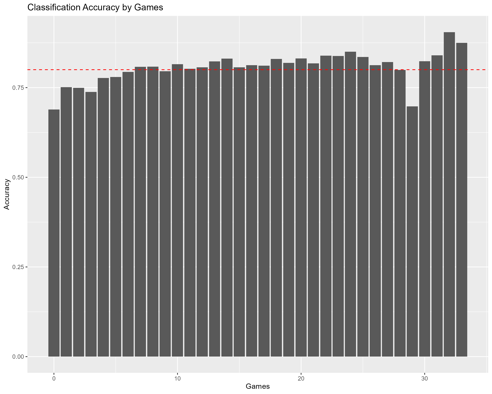

```{r setup, include=FALSE}
knitr::opts_chunk$set(echo = FALSE,
                      eval = TRUE,
                      include = TRUE,
                      message = FALSE,
                      warning = FALSE)
library(knitr)
library(tidyverse)
library(arrow)
library(ggformula)
```


# Project Design

## Project Overview
High school athletics are a major part of the culture in the United States, however it is a field largely untouched by data and analytics. Not only is information regarding high school sports sometimes difficult to find, but it is often heavily disorganized and messy. One of the most difficult things to measure in high school sports is how good a team is relative to other teams. This is even difficult within a single sport in a single state. Each state has hundreds of teams, often spanning multiple classes, sometimes separated by leagues (private and public), and generally distanced by geography. Occasionally, states will have coaches rank the top ten teams, but this is almost entirely subjective, driven heavily by the opinions and bias of the coaches who vote, and fails to measure any other teams not in the top 10. Our questions going into this analysis and project revolve around addressing these issues by focusing on a couple of key questions:

1. Can historical data for a single high sport in a single state be accumulated into a single dataset that is easily accessible and usable?

2. Can we predict an outcomes, both scores and win probabilities, of every single game played with a data driven model that is accurate enough to be useful?

3. Can we rank every team in the state, rather than just the top 10 with analytics rather than opinion?

4. Can we determine what factors are most important in determining the outcome of a high school game?

5. Can this information be processed and presented in a way that is easily accessible and interpretable to the public, while being adaptable to new data?

## Data Description

To address these questions, we will focus on the Missouri State High School Activities Association (MSHSAA) women's basketball data. The data for this project will be scraped from the MSHSAA women's basketball scoreboard, which has game scores going back approximately 15 years. This data will be aggregated into a single dataset that can then be cleaned, processed, transformed, and analyzed. The data will include information on the teams, scores, locations, dates, and classes of the teams involved. The plethora of easily accessible game data makes this a perfect candidate for analysis, and the field of women's high school basketball in Missouri is almost entirely unexplored.


## Steps of the Analysis
1. **Scrape the data**: Use the `rvest` package to scrape the data from the MSHSAA website and put it in a data frame.
2. **Clean the data**: Use the `dplyr` package to clean the data, including removing unnecessary columns and rows, and converting data types. This also involves finding errors in the data and replacing them with the most accurate data.
3. **Create a modeling dataset**: Use the `dplyr` package to create a modeling dataset that includes relevant features for analysis and prediction. This includes creating new features based on existing data, such prior team scoring metrics, strength of schedule metrics, and strength of record metrics.
4. **Perform EDA**: Use the `ggplot2` package to perform exploratory data analysis (EDA) on the modeling dataset. This includes creating visualizations to understand the distribution of features, relationships between features, and any potential patterns in the data.
5. **Build a predictive model**: Use the `tidymodels` package to build a predictive model using the modeling dataset. This includes splitting the data into training and testing sets, selecting relevant features, and training the model using various algorithms (e.g., linear regression, decision trees, etc.). 
6. **Evaluate the models**: Use the `yardstick` package to evaluate the performance of the predictive model using various metrics. For the point estimation, this includes metrics such as RMSE, MAE, and R-squared. For the classification model, this includes metrics such as brier score, log loss, and accuracy.
7. **Interpret the importance of variables**: Coefficients or importance scores from the model will be used to interpret the importance of different variables in predicting the outcome of games. This includes understanding which features are most influential in determining the score and how they interact with each other.
8. **Make predictions**: Use the trained model to make predictions on new data. This includes using the model to predict the outcome of future games and evaluating the accuracy of those predictions.
9. **Create a Shiny app**: Use the `shiny` package to create a Shiny app that allows users to interact with the model and make predictions. It will also include team rankings that are a measure of projected performance against teams in the same class based on the model.
10. **Make the Process Automated**: Adjust the scraping, cleaning, modeling data creation, and prediction processes to be automated. This includes creating a function that can be run on a schedule to update the data and predictions automatically each night.

## Primary Challenges Faced
1. **Data Cleaning**: The data scraped from the MSHSAA website was not in a clean format, and contained plentiful errors. This means that not only will I have to scrape the scoreboard page, but when certain conflicts arise scrape the relevant team pages and automate the decision process on which data to use.
2. **Lack of Data to Start the Season**: The data at the start of the season is limited and makes prediction difficult. This means that I will have to find some way to estimate the effect of prior years data as well as current data and league average data to make predictions that are not completely random.
3. **Correlation between Predictors**: A handful of the predictors in the modeling dataset are correlated with each other, which can lead to multicollinearity issues in the predictive model. This means that I will have to be careful in selecting the features to include in the model and may need to use techniques such as regularization to mitigate this issue.
4. **Automation**: Automating the scraping, cleaning, modeling data creation, and prediction processes is a complex task that requires careful planning and testing, which sometimes fails based on internet connection and the MSHSAA website. This means that I will have to create a robust system that can handle errors and exceptions, and ensure that the data is updated regularly.

## Modeling Goals
######## Point Estimation
1. RMSE less than 10 points
2. MAE less than 7.5 points

######## Classification
1. Brier score less than 0.15
2. Accuracy greater than 0.80

# Project Work Completed
## Steps of the Analysis
1. **Scrape the data**: The data was successfully scraped from the MSHSAA girl's scoreboard using the `initial_scrape.R` script, which uses the functions from `Functions/webscrape_new_games.R`. The original data consisted of 203,272 rows and 20 columns related to the teams and identifying traits about them, score, location, and date. The data contains two rows for every game that was played. One from each teams perspective. The data is stored at `Data/initial_data.parquet`. This data consists of every game played from November 1, 2010 to January 27, 2025. The head of the data is shown below
```{r}
initial_data <- read_parquet("Data/initial_data.parquet")
head(initial_data)
```

2. **Clean the data**: The data was cleaned in the `initial_scrape.R` script as well, calling functions from `Functions/clean_errors.R` and by association `Functions/add_home_away.R`, `Functions/clean_add_reverse_row.R`, and `Functions/scrape_team_page.R`. There were 8 major types of errors in the data. These were:  
 - Same score between teams within one week of each other  
 - Almost same score between two teams within 3 days of each other (scores within 5)  
 - One teams score basically nothing (score for one less than 5)  
 - Flipped scores (One score in day or within 3 days has one team winning and the the other has the other team winning with the same score)  
 - Two different scores in the same day  
 - Score for one of the teams is equal to their schoolid.  
 - The School or opponent is "TBD"  
Each of these required unique solutions to fix, which often involved scraping team pages to see if the score was listed there. The data was then saved to `Data/cleaned.parquet`. This cleaned data consists of 196,792 rows and 20 columns.

3. **Create a modeling dataset**: The modeling dataset was created in the `initial_scrape.R` script as well, calling functions from `Functions/create_modeling_data.R`. This involved creating new features based on existing data, such as prior team scoring metrics, strength of schedule metrics, strength of record metrics, and historical versions of each of the metrics. Each metric only includes prior information about the team, meaning no future or current game data is leaked into the predictors. The modeling dataset was saved to `Data/modeling_data.parquet`. The modeling dataset consists of 196,792 rows and 70 columns. Please check out the `modeling_data_glossary.R` script for a full description of the features.

4. **Perform EDA**: The EDA was performed in the `EDA.R` script, which includes visualizations to understand the distribution of features, relationships between features, and any potential patterns in the data. The scores themselves for the girls games are normally distributed, with a mean of 45 and standard deviation of 15. A plot of the scores can be seen below. 

```{r}
modeling_data <- read_parquet("Data/modeling_data.parquet")
# df_stats(~score, data_filtered, mean, median, sd, IQR)
gf_density(~score, data = modeling_data, color = "red") |>
  gf_dist("norm", mean = mean(modeling_data$score), sd = sd(modeling_data$score))+
  labs(title = "Score Distribution",
        subtitle = "Normal distribution with mean = 45 and sd = 15 overlayed")
```


The primary issue with the data is the large amount of missing values in the modeling data, which occur for the first game for all of the teams. Many of the variables are also relatively normally distributed until you impute values for missing data, which makes more leptokurtic distributions. Correlations between variables and the target variable were also examined, as well as correlations between pairs of variables. It was found that a teams own statistical measures were more closely related to performance than the opponents statistical measures. The most highly correlated variables with the score of game for a team were all variables that measure a teams offensive scoring ability. 

| Variable | Correlation |
| --- | --- |
| Prior PTS Per Game | 0.576 |
| Offensive Weighted Efficiency | 0.554 |
| Offensive Efficiency Rate | 0.552 |

Offensive weighted efficiency attempts to measure offensive performance compared to the amount of points allowed per game that the opponent averages. Offensive efficiency rate attempts to measure the offensive performance of a team on an estimated possession basis. Obviously these were all highly correlated with each other as well. Since the data for each game is essentially duplicated, opponents prior points per game is the most highly correlated with the opponents score and so on. Please look at the `EDA.R` script for more details on the exploratory data analysis.


5. **Build a predictive model**: 
It was decided very quickly to only use data from 2015 on for building a model. This was done because all prior season values for 2011 are NA. Additionally, approximately half of all games from 2012 are not reported. By 2013 it appeared most games were being properly recorded. In order to allow an extra buffer year after this and because we would still have 10 years worth of data for training and testing it was decided to use the 2014-2015 season as the earliest data for the model.

Model code for a variety of different model structures has been stored in `Model_Code/`. Original models were fit for a variety of models and the original results can be seen in the plot below. 

```{r}


```

The models include linear regression models, boosted trees, neural networks, mixed effects models, penalized regression, and more. Modeling was done using the `tidymodels` package. Data was split into training and testing sets each time with a 60/40 split. The same seed was used for each model. Most used tuning with resamples and cross validation and then tuning with `tune_bayes()` to find the best hyperparameters. 

After careful consideration regarding the predictive power of different models compared to their interpretability, reusablity, and ease of use, it was decided to use a simple linear regression model for predicting score and opponent's score and a logistic regression model for predicting the outcome (win or loss) of the game. The reasoning for this was rooted largely in practical reasons. The simple models were not getting significantly outperformed by more complex models, yet provided ease of use and interpretability. Coefficients for linear regression can be easily interpreted, as can the odds ratios for logistic regression. Additionally these models allowed for reciprocal predictions, meaning that the model would effective predict the same score for the first observation for the game as the second observation, allowing predictions to only have to be made on a single observation of the game. This is not true for most other models. Additionally it prevented models for classification and point estimation from being separate and producing different results.

One main problem was still vexing the predictions though, early season games in which teams had played very few or no games. Rather than adding more confounding variables such as the teams points per game last year (which would also become relatively insignificant as the season went on) to the model, I decided to attempt to weight the associated predictors from the previous year,  the current year, and league averages together in a single predictor. The idea is that these weighted predictors value previous years success and league averages more at the start of the season and then value current year performance more as the season goes on. This variable mixing tuning process was done with a grid of 99 different starting weight combinations rates of decay. The best weights for the score model and the classification model can be seen below. 

```{r}
read_rds("Data/weights_results.rds") |> 
  group_by(.metric) |>
  arrange(mean) |> 
  mutate(rank = ifelse(.metric == "rsq", n() - row_number() + 1, row_number())) |> 
  group_by(past_success, league_avg, c) |> 
  summarize(rank_rmse = rank[.metric == "rmse"],
            rank_rsq = rank[.metric == "rsq"],
            rank_mae = rank[.metric == "mae"],
            rank_mape = rank[.metric == "mape"]) |> 
  ungroup() |> 
  mutate(rank_mean = (rank_rmse+rank_rsq+rank_mae + rank_mape)/4,
         rank_max = pmax(rank_rmse, rank_rsq, rank_mae + rank_mape)) |> 
  arrange(rank_mean) |> 
  head() |> 
  kable(caption = "Best Weights for Score Model")

read_rds("Data/weights_results_class.rds") |> 
  group_by(.metric) |>
  arrange(mean) |> 
  mutate(rank = ifelse(.metric == "accuracy", n() - row_number() + 1, row_number())) |> 
  group_by(past_success, league_avg, c) |> 
  summarise(rank_brier = rank[.metric == "brier_class"],
            rank_accuracy = rank[.metric == "accuracy"],
            rank_mn_log_loss = rank[.metric == "mn_log_loss"]) |> 
  ungroup() |> 
  mutate(rank_mean = (rank_brier+rank_accuracy+rank_mn_log_loss)/3,
        rank_max = pmax(rank_brier, rank_accuracy, rank_mn_log_loss)) |> 
  arrange(rank_mean) |> 
  head(6) |> 
  kable(caption = "Best Weights for Classification Model")
```

Based on this the best overall weights were decided and are as follows:   
- Starting Previous Year Weight: 0.8  
- Starting League Average Weight: 0.2  
- Constant for Decay as Game Number Increases: 0.8  

The final models were then fit on the training data and used to make predictions on the testing data. The final models were saved to
`Models/lm_reg.rds`, `Models/lm_opp_reg.rds`, and `Models/class_glm_mod.rds`.


6. **Evaluate the models**: The models were evaluated using the `yardstick` package. The final regression model was evaluated using RMSE, MAE, and R-squared. The final classification model was evaluated using Brier score, log loss, and accuracy. The results of the evaluation can be seen below were saved to `Data/lm_reg_metrics.rds` and `Data/class_glm_metrics.rds` and can be seen below. 

```{r}
read_rds("Data/lm_reg_metrics.rds") |> 
  kable(caption = "Final Regression Model Test Values")

read_rds("Data/class_glm_metrics.rds") |> 
  pivot_wider(names_from = .metric, values_from = .estimate) |> 
  select(Accuracy = accuracy, Brier = brier_class, Log_Loss = mn_log_loss) |> 
  kable(caption = "Final Classification Model Test Values")
```

Obviously these results were just a little below the goals set for the project. For the linear regression model the RMSE was 10.5 just above the goal of 10, the MAE was 8.3, which is within a point of our goal of 7.5. 

The classification model was much more successful in relation to our preset goals. The Brier score was 0.14, just below the goal of 0.15, and the accuracy was 0.796, which with some rounding reaches the goal of 0.80.

With some more careful scrutiny it can be seen the main culprit for our shortcomings resides in early season games, despite our best efforts to minimize the effects of those games. This can be seen effectively in the plots below.

```{r}



```


Obviously, it would've been ideal to reach all of our prediction goals, but nevertheless the models are still quite useful, particularly as the season preogresses.